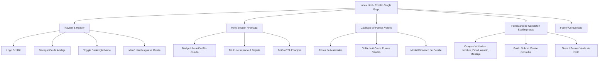

# Arquitectura del Sistema — EcoRio

## 1. Visión del Producto
**EcoRio** es una plataforma web orientada a la sustentabilidad y economía circular para la ciudad de **Río Cuarto, Córdoba**. Su objetivo es doble:
1. **Para los ciudadanos:** Facilitar la localización de Puntos Verdes y estaciones de reciclaje, informando qué materiales se reciben, horarios y consejos de separación.
2. **Para las EcoEmpresas:** Ofrecer un canal de contacto directo para articular la compra, retiro y valorización de materiales reciclables acopiados por volumen.

---

## 2. Stack Tecnológico

El proyecto adopta un enfoque **JAMstack / Vanilla Web Moderno**, priorizando la velocidad de carga, la portabilidad, la simplicidad de mantenimiento y la ausencia de dependencias de compilación complejas:

| Capa | Tecnología | Justificación Técnica |
| :--- | :--- | :--- |
| **Estructura** | **HTML5 Semántico** | Mejora la accesibilidad (a11y), el posicionamiento (SEO) y establece una jerarquía de información clara sin divitis. |
| **Estilado & Diseño** | **TailwindCSS v3 (CDN)** | Provee diseño responsive mediante clases de utilidad atómicas, soporte nativo de Dark Mode (`class="dark"`) y consistencia estética sin hojas CSS extensas. |
| **Lógica e Interacción** | **JavaScript ES6+ (Nativo)** | Manipulación directa del DOM, gestión de eventos desacoplada, almacenamiento local (`localStorage`) y renderizado dinámico sin la sobrecarga de frameworks. |
| **Tipografía & Assets** | **Google Fonts (Poppins / Inter)** | Tipografías modernas con alto grado de legibilidad en pantallas retina y móviles. |

---

## 3. Mapa de Módulos y Componentes de la Interfaz

### Descripción de Módulos:
* **Módulo de Navegación (`Navbar`):** Fijo en la parte superior (`sticky top-0 z-50`). Contiene el selector de tema con memoria en `localStorage`, enlaces suaves hacia las secciones y botón hamburguesa en dispositivos móviles.
* **Módulo Portada (`Hero`):** Primer impacto visual. Presenta el propósito de EcoRio en Río Cuarto con llamados a la acción claros.
* **Módulo Catálogo (`Cards & Modal`):** Renderizado dinámico de los 6 Puntos Verdes a partir de un arreglo de datos inmutable. Al hacer clic en "Ver detalles", se abre un modal accesible que detalla dirección exacta, horarios y materiales aceptados.
* **Módulo de Contacto (`Formulario`):** Captura requerimientos de empresas o vecinos mediante validación nativa y simulación de envío con confirmación visual (toast verde).
* **Módulo de Pie de Página (`Footer`):** Créditos institucionales, enlaces rápidos y datos de contacto de la ciudad.

---

## 4. Tecnologías Prohibidas (Límites Estrictos)

Para asegurar la simplicidad, apego al programa de la materia y rendimiento óptimo, **queda terminantemente prohibido incorporar**:

* ❌ **Frameworks SPA reactivos:** React, Vue, Angular, Svelte (mantener todo en HTML5 y JS nativo).
* ❌ **Entornos de Backend:** Node.js, Express, NestJS, Python/Django, PHP (la aplicación es 100% frontend estática).
* ❌ **Bases de Datos Externas o BaaS:** Firebase, Supabase, MongoDB, MySQL, PostgreSQL.
* ❌ **Estilos en línea desordenados:** No usar `style="..."` directamente en las etiquetas (todo se estiliza con clases TailwindCSS).
* ❌ **Bundlers pesados:** No requerir Webpack, Rollup o configuraciones complejas de build para visualizar el sitio. Debe funcionar abriendo `index.html` en el navegador o mediante un servidor estático local.
