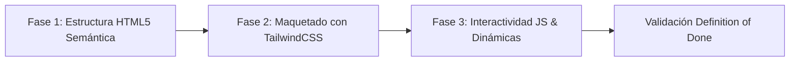

# Flujo de Trabajo y Metodología SDD — EcoRio

Este documento rige la metodología de desarrollo, el orden de construcción de la aplicación y los criterios de aceptación (*Definition of Done*) bajo el estándar **SDD Adaptativo (Software-Driven Design)** inspirado en [Gentle AI](https://github.com/Gentleman-Programming/gentle-ai).

---

## 1. Fases del Flujo de Maquetado Incremental

El desarrollo de la aplicación se ejecuta en 3 fases secuenciales y no destructivas:

### ➔ Paso 1: Esqueleto Semántico HTML5
* Creación de la estructura del documento con etiquetas semánticas obligatorias (`<header>`, `<nav>`, `<main>`, `<section>`, `<article>`, `<footer>`).
* Inclusión de metadatos indispensables (`meta charset="UTF-8"`, `meta viewport`, favicon e iconografía SVG).
* Definición de atributos de accesibilidad (`aria-label`, `role="dialog"`, `alt` descriptivos).

### ➔ Paso 2: Estilos y Maquetado Visual con TailwindCSS v3
* Conexión del script CDN de TailwindCSS y configuración del modo oscuro por clases (`tailwind.config = { darkMode: 'class', ... }`).
* Maquetado de la barra de navegación responsive y menú móvil.
* Maquetado del Hero y propuesta de valor de Río Cuarto.
* Estilado de la grilla de tarjetas con efectos hover (`-translate-y-1.5`, sombras y zoom suave en fotos).
* Maquetado del modal emergente y del formulario de contacto.

### ➔ Paso 3: Interactividad, Lógica y Dinámicas en JavaScript
* Implementación de la alternancia de tema (Modo Oscuro / Modo Claro) con persistencia en `localStorage`.
* Carga y renderizado dinámico del catálogo de 6 Puntos Verdes a partir de la colección de datos.
* Apertura y cierre accesible del Modal de Detalle (clic en botón, clic en backdrop, tecla Escape).
* Control del menú hamburguesa en mobile.
* Manejo del formulario de contacto: validación en cliente, prevención de recarga nativa (`e.preventDefault()`) y despliegue del banner de éxito visual (toast verde).

---

## 2. Definition of Done (DoD) — Criterio de Finalización

Ningún entregable o componente se considera finalizado sin verificar exhaustivamente:

1. **Justificación Técnica:** Explicar el **POR QUÉ** antes del **CÓMO** de cualquier bloque o lógica implementada.
2. **Los 4 Estados de UI Obligatorios:**
   - ⌛ **Loading:** Carga suave de recursos, imágenes con placeholders y transiciones fluidas.
   - 📭 **Empty:** En caso de filtros sin resultados o listas vacías, mostrar mensaje de ayuda contextual.
   - ⚠️ **Error:** Manejo amigable de campos vacíos en el formulario o imágenes rotas mediante fallback.
   - ✅ **Success:** Notificación visual clara (alerta verde) ante el envío exitoso del formulario y confirmación de acciones.
3. **Cero Errores en Consola:** Inspección en DevTools (F12) garantizando ausencia de advertencias rojas o fallos de ejecución.
4. **Diseño Responsive Verificado:**
   - Visualización perfecta en viewport móvil (360px - 414px) en 1 columna sin scroll horizontal.
   - Visualización fluida en tablets (768px) en 2 columnas.
   - Visualización equilibrada en desktop (>1024px) en 3 columnas.
5. **Código Limpio y DRY:** Nombres autodocumentados, funciones pequeñas con una sola responsabilidad y ausencia de código muerto o comentado.
